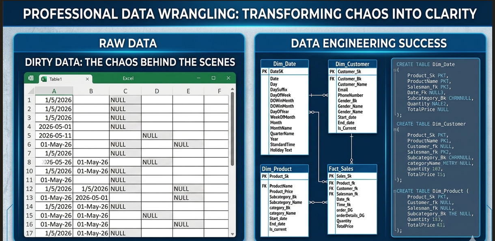
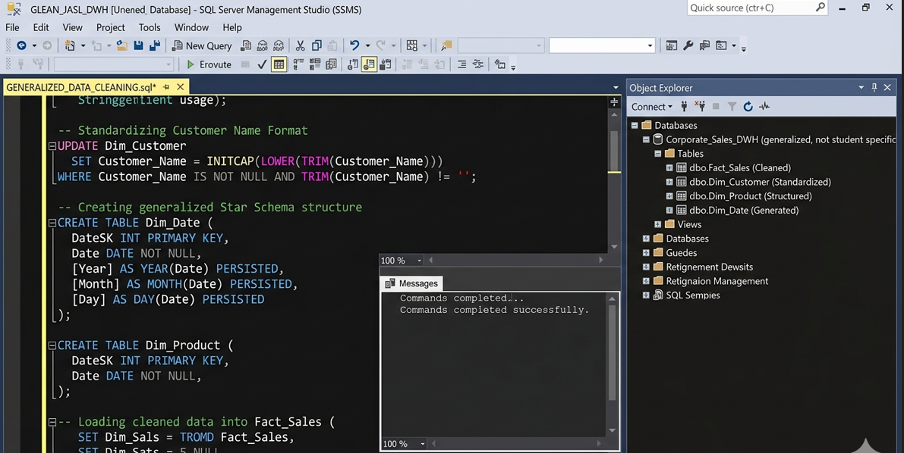

Data Cleaning and Standardization (SQL)
Overview
Data quality is the backbone of any reliable analysis. This project demonstrates advanced SQL techniques to transform "dirty" raw data into a clean, consistent, and usable format for business intelligence.

Cleaning Process & Results

Key Technical Implementations
Duplicate Removal: Using Common Table Expressions (CTEs) and ROW_NUMBER().

Handling Nulls: Implementing logical defaults for missing data points.

Data Standardization: Trimming whitespace and unifying text casing for consistent reporting.
